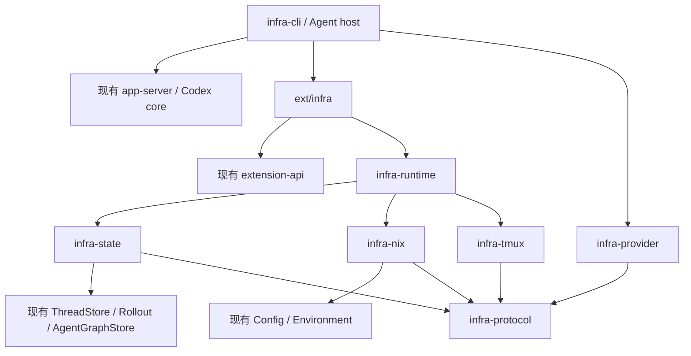

# Codex 多机器 Agent 基础设施：实施与实装实验方案

需求基线：[infra-requirements.md](infra-requirements.md)。源码核对基线：`fa1945855e`。本文将需求转换为包边界、接入点、实施顺序和实装实验流程；包名与命令是拟议接口。

**推荐路线：每个 Codex 进程负责自身推理、上下文和工具执行；独立 Rust crates 承载跨机器生命周期、tmux 通信、工作区、持久化与资源协调。生产 Agent 使用 tmux 内的独立宿主进程，通过既有扩展与少量通用接入接口组合这些能力。**

## 1. 实施原则与范围

1. Source Repository 保存 fork、Rust crates、Nix 构建与部署；Team State Repository 保存真实运行配置、账户、明文凭据、Skills、Memory 和全部 Session。
2. 新业务逻辑首先落入独立 crate；Codex 原有模块承担通用扩展点和装配工作。
3. 使用同一个 Cargo workspace 和现有 Bazel 构建体系。独立 crate 表达代码与依赖边界，两个管理仓库的划分保持需求约定。
4. 原有配置合并、认证协议、rollout 格式、compaction、工具执行、Skills/Memory 格式继续由原模块负责。
5. tmux、Nix、Git refs、路由和账户选择各自具有明确实现归属。Core 通过通用接口使用这些能力。
6. Linux/Nix 作为生产运行目标；通用数据和 Git 逻辑保持可移植，tmux/NixOS 运行能力面向生产环境实现。
7. 分阶段完成代码与接口交付；全部实现完成后直接部署，通过真实工作任务发现并修复问题。

**最高实施约束：整个实现过程禁止编写或运行任何测试，包括单元、集成、快照、回归、模拟 Provider、fixture、基准和负载测试；修复问题时同样适用。实施前及分阶段实施中均不安排运行实验。必要的编译、格式化、schema 和锁文件生成属于构建维护，构建与部署入口关闭自动测试。全部实现完成后直接实装，以真实任务发现问题并修复。**

100 台机器、1,000 个 Agent 仅作为架构设计指标，用于确定分片、状态归属、有界上下文和连接复用边界；实施与实装不设置相应规模门槛。

每个阶段报告同时列出新增包代码、既有文件改动、既有 crate 依赖变化。评估“最小改动”主要看后两项及上游接口耦合，而不是通过压缩必要实现来减少总行数。

当前主线是 Codex 主 Agent 分解任务并调度 DeepSeek v4.1 Flash Subagent；只有 DeepSeek 无法解决任务时，才启动使用 Codex 的 Subagent 继续处理。主 Agent 与升级后的 Codex Subagent 可以使用同一个 Codex 账户，DeepSeek 请求绑定其自身 Provider 凭据。多账户管理和其他 Provider 的通用能力继续保留，优先完成这条日常工作链路。

运行职责分为单 Agent 引擎、单机器 runtime、按角色协作的任务组织三个层级。各进程的 ThreadManager 管理本地 thread；全局 Directory 保存跨机器关联。leader/parent 确定目标与工作范围，执行 Agent 在范围内认领并推进任务，machine runtime 确认归属并执行本机资源操作。Session 按机器分片等布局是本方案对需求基线的实施细化，统一写入 Team State Repository。

## 2. 已核对的 Codex 扩展基础

以下判断来自当前 checkout，实施时以对应接口的新版本再次核对。

| 能力 | 当前源码与事实 | 实施选择 |
| --- | --- | --- |
| 扩展注册 | [registry.rs](ext/extension-api/src/registry.rs) 已支持工具、上下文、生命周期、配置和用量扩展，并提供 `to_builder()` | 接入包在原有集合上追加贡献者，复用内置扩展装配 |
| 工具生命周期 | [contributors.rs](ext/extension-api/src/contributors.rs) 的 `ToolLifecycleContributor` 能观察成功、失败、取消；回调返回 `()` | awaited callback 连接 checkpoint；pending 状态与结果/结束交付条件由 runtime 和宿主管理 |
| 工具返回顺序 | [registry.rs](core/src/tools/registry.rs) 在返回工具结果前 await lifecycle finish | 复用这一同步位置执行 checkpoint |
| 配置 Hooks | [hook_runtime.rs](core/src/hook_runtime.rs) 的 PostToolUse 位于成功输出路径，SessionEnd 对 root 执行 | 保留 Hook 配置能力；完整 checkpoint/finalize 生命周期由扩展和宿主连接 |
| Agent 契约 | [api.rs](core/src/agent/api.rs) 已公开 `AgentControl`；`close` 契约包含关闭后代 | 用作行为对照；生产 runtime 明确独立生命周期，后端统一另行迁移 |
| Agent 实际调用 | [thread_manager.rs](core/src/thread_manager.rs)、[spawn.rs](core/src/tools/handlers/multi_agents_v2/spawn.rs) 仍使用具体 `LocalAgentControl`；当前未找到其 `AgentControl` 实现 | 首期通过 native tool extension 接入生产 Agent runtime |
| 扩展 Agent runner | [ext/agent](ext/agent/src/lib.rs) 仍调用 `ThreadManager::spawn_subagent` 创建内部 thread | 复用已有类型和行为经验，进程启动由 tmux runtime 承担 |
| Memory 后台 Agent | [memories/write](memories/write/src/runtime.rs) 的 consolidation 直接调用 `start_thread` | 将具有独立任务与生命周期的后台 Agent 一并接入受管启动服务 |
| 会话存储 | [ThreadStore](thread-store/src/store.rs) 是独立 crate 的公开契约，`ThreadManager::new` 接受 `Arc<dyn ThreadStore>` | 在新 crate 实现包装 LocalThreadStore 的 GitSessionAdapter |
| Rollout 留存 | [policy.rs](rollout/src/policy.rs)、[live_thread.rs](thread-store/src/live_thread.rs) 会执行持久化筛选 | 规范 rollout 与完整审计事件分别采集，建立关联 |
| Agent 图 | [AgentGraphStore](agent-graph-store/src/store.rs) 提供 parent/child 边存储接口 | Directory 保存完整描述，已有 graph 接口提供拓扑视图 |
| app-server 宿主 | [in_process.rs](app-server/src/in_process.rs) 提供进程内启动；[message_processor.rs](app-server/src/message_processor.rs) 内部创建 stores 和扩展；[extensions.rs](app-server/src/extensions.rs) 装配内置扩展 | 增加可选宿主依赖注入入口，保持现有服务、队列与默认装配行为 |
| app-server 事件 | `InProcessServerEvent::Lagged` 表示有界通知队列可能丢弃事件 | 完整审计在数据产生侧入 spool，通知用于实时展示与观察 |
| 线程初始绑定 | `StartThreadOptions::thread_extension_init` 支持类型化 `ExtensionDataInit` | 保存运行绑定；模型可见片段单独按上下文约定呈现 |
| 配置来源 | [config loader](config/src/loader/README.md)、[ThreadConfigLoader](config/src/thread_config.rs) 已有分层、字段来源和版本 | 适配 Git/Nix 来源，保持现有合并规则 |
| 执行环境 | [Environment](exec-server/src/environment.rs)、[ExecBackend](exec-server/src/process.rs) 已有执行边界；`Exited` 与 `Closed` 分别表示退出与输出结束，事件回放有容量上限 | Nix 环境、输出生产侧 recorder、后台修改完成与输出 drain 分别接入 |
| 多 Provider | [ModelProviderInfo](model-provider-info/src/lib.rs) 支持 endpoint、认证、header；`WireApi` 当前只有 Responses | Responses 直接复用；其他协议由独立适配包转换 |
| 认证 | [AuthManager](login/src/auth/manager.rs) 已有 ExternalAuth、reload、auth change receiver；刷新锁为进程内锁 | 保留单账户视图，在外层实现选择、版本和跨机器刷新协调 |
| 推理准入 | ExtensionRegistry 的 `TurnStartAdmission` 是同步 turn 开始入口；[telemetry.rs](codex-api/src/telemetry.rs) 已有请求/流观察能力 | 补足可等待的实际请求准入和实际凭据版本关联，覆盖重试、compaction 与启用的传输 |
| 团队知识 | [Skills](skills/src/lib.rs)、[Memory read](memories/read/src/lib.rs)、`memories/write` 和既有扩展 | 在指定 revision 上加载现有格式，知识整理作为普通受管 Task |
| Nix | 根目录 [flake.nix](../flake.nix) 已有 package/devShell；[default.nix](default.nix) 当前 `doCheck = false` | 扩展已有 flake，增加运行 package 与部署输出，保留 `doCheck = false` |

**关键判断：源码中的公开 AgentControl 契约不等于已经可替换的生产后端。** 首期直接迁移所有调用会涉及 resolver、通知、内部 session、预算和关闭语义。已有工具扩展入口更适合承载第一版实现。

## 3. Rust 包边界

建议按以下八类职责形成独立包，按阶段创建，每个包交付明确的运行职责与接口。`codex-infra-*`、目录及 CLI 名称均为本文占位名称，尚未确定正式命名；落地遵循仓库 `codex-` crate 前缀约定。

| 包与路径 | 负责内容 | 主要依赖 |
| --- | --- | --- |
| `codex-infra-protocol` / `infra/protocol` | AgentExecution、TaskSpec/TaskAssignment、WorkingContextEntry、Contribution、EscalationRequest、身份、消息、事件与 wire framing | serde、既有通用 ID/path 类型 |
| `codex-infra-state` / `infra/state` | Git refs、分片归档、spool、Session adapter、worktree、checkpoint、批量 branch push、账户文件、配置/知识版本及认领/工作记忆/贡献索引 | protocol、thread-store、rollout、agent-graph-store、Git |
| `codex-infra-nix` / `infra/nix` | flake 解析、build plan、配置 generation、Nix 环境实现和 hostid 读取 | protocol、codex-config、exec-server |
| `codex-infra-tmux` / `infra/tmux` | tmux control mode、pane 生命周期、动态 TCP、framing、收发记录、collector | protocol、进程/网络库 |
| `codex-infra-runtime` / `infra/runtime` | Agent 生命周期、Directory、role 路由、任务认领/依赖推进、贡献整合归属、消息呈现调度、本机资源与请求额度协调、账户刷新、恢复 | protocol、state、nix、tmux |
| `codex-infra-provider` / `infra/provider` | Responses 与目标供应商协议转换、流式工具调用、认证/请求绑定、usage 和能力映射 | protocol、现有 API 类型、HTTP/SSE 库 |
| `codex-infra-extension` / `ext/infra` | Codex 工具与生命周期贡献者、任务认领/工作记忆/贡献工具、上下文绑定、认证适配和宿主装配 | extension-api、runtime、必要的 core 公开类型 |
| `codex-infra-cli` / `infra/cli` | `codex-infra` 二进制：Agent 宿主、machine runtime、gateway、账户和运维命令 | extension、app-server、provider、runtime |

基础设施领域包保持对 `codex-core` 的单向边界：只有 Codex 接入包和最终宿主需要依赖 core。Core 使用通用扩展 API，不导入 `infra-runtime`、`infra-tmux`、`infra-state`。



MachineCatalog、RoleRegistry、GitAccountStore 首先是上述包内模块；当它们具有独立复用场景时再拆包。单个 Rust 模块目标小于 500 行，接口只公开实际调用需要的类型。

## 4. 最小接入方案

### 4.1 独立 Agent 宿主

每个受管 Agent 在 tmux pane 中启动一个 `codex-infra agent` 进程。该进程嵌入既有 app-server，运行一个主要 Codex thread，并负责 stdin/stdout frame、配置视图、Session adapter 和生命周期。

宿主通过新增 builder/host services 入口组合默认服务与基础设施适配器。额外扩展在原有 `thread_extensions` 结果上追加，ThreadStore、AgentGraphStore、AuthManager 与队列持久化按一致的服务组合装配；接入包复用现有初始化逻辑。

进程内 app-server 请求只驱动当前 Agent。来自其他 Agent 的输入先通过接收 pane 的 stdin，再由当前宿主转换成已有 turn/input 请求。消息来源、消息 ID、role、repo 和 commit 作为结构化上下文保留。

Root Agent 使用同一宿主和通信协议。`attach` 客户端展示 Agent 输出并把用户输入送到对应 pane；后续接入既有 TUI 时复用同一 v2 能力。

宿主保存 `AgentId ↔ ThreadId` 映射；恢复延续 AgentId，fork 创建新的 AgentId 和工作 branch。Parent 是任务关系，进程的存活由所在机器的 tmux runtime 维持。

### 4.2 生产 Agent 工具

通过 `ToolContributor` 提供 spawn、send、followup、list、inspect、wait、interrupt、resume、terminate 等工具。可沿用现有工具名称，工具 schema 增加 Task、Machine、role、Provider/Account 选择信息。

生产配置选择这组扩展工具；内置进程内 multi-agent 工具在该配置中关闭。普通 Codex 的既有工具与运行方式沿用现状。扩展装配提供明确的工具集合与名称映射。

当前工作负载的 spawn 默认解析为 DeepSeek v4.1 Flash 绑定；Codex 主 Agent 根据任务求解情况选择升级，并在新 Subagent 启动前解析 Codex 账户和模型。路由策略保存在 Team State profile 中，角色继续描述职责，Provider 绑定描述执行该职责的模型。

spawn 的控制请求处理进程和资源准备；任务描述、Bootstrap、fork 的上下文内容由发送 Agent 写入自身 stdout，经 tmux 到达目标。send/followup 返回投递 receipt，wait 返回运行/交付状态；对方的语义完成结果作为独立消息经 tmux 进入接收 Agent。

Directory 对接现有 `AgentGraphStore`，并扩展 role、机器、placement 和 routing 元数据。这里复用图存储契约，不同时维护两套各自决定 parent/child 的拓扑。

Memory 整理、Skill 分析、AgentRunner 和启用配置中的其他独立后台 Agent 由同一启动服务创建。P0 列出 `spawn_subagent`、内部 session、直接 `start_thread` 等实际调用入口；P4 对具有独立任务/职责/结果的调用逐项接入，每个 Agent 都有进程、pane、worktree、推理绑定和 Session。单个 Agent 内的 compaction、重试和多次推理继续归属当前 Agent。

### 4.3 预计修改的上游位置

| 接入点 | 最小修改 | 实现职责 |
| --- | --- | --- |
| app-server 宿主装配 | 增加独立的可选 host services/builder 入口，注入额外扩展、ThreadStore、AgentGraphStore、AuthManager；原入口委托默认值 | 原入口继续采用默认依赖组合 |
| `core/context` | 新增少量类型化 identity、Task、route/message fragment，实现 ContextualUserFragment | 类型化来源归因、增量上下文、恢复与 compaction 绑定 |
| Agent 工具与后台入口 | 注册受管工具，将启用的独立后台 Agent 接入同一启动服务 | 每个实际 Agent 的进程、pane、worktree 和 Directory 记录齐全 |
| 工具与进程生命周期 | 复用 awaited callbacks；补足输出生产侧 recorder 和后台完成接入，按接口证据决定通用扩展形态 | 失败/取消修改、输出 drain、pending 与最终交付顺序 |
| 推理请求边界 | 组合 telemetry 与认证接口，补足可等待的请求准入及实际请求 observer | 重试/compaction/HTTP/WebSocket 使用正确额度范围，凭据和 usage 对齐 |
| 认证装配 | 注入当前账户视图，接入 ExternalAuth/reload 和凭据版本发布 | 多账户并发与同账户跨进程刷新 |
| CLI | 可选增加 `infra`/`account` 薄分派；完整命令逻辑放在新包 | 薄分派 argv 与退出码 |
| Workspace/Bazel/Nix | 注册新 crate、依赖和 package/部署输出 | Cargo/Bazel 锁文件与 Nix 构建产物 |

公开接口优先采用新增 builder/新入口，现有调用保持原默认值。业务实现与扩展点调整分别提交，避免在大型核心文件中混入 Git/tmux/Nix 逻辑。

宿主装配、类型化 context 和启用的 Agent 创建入口是已确认的接入工作。完整原始流采集、后台修改完成和实际请求准入必须实现；P0/对应阶段确定已有接口能覆盖的范围及需要新增的通用入口。工具完成回调目前返回 `()`，pending 与最终交付首先在 runtime/宿主管理；若 Core 需要直接表达 checkpoint 完成状态，再增加小型通用结果接口。CLI 薄分派可在独立二进制完整工作后接入。

AgentControl 后端统一可以在独立方案中继续推进；首期交付不以整套接口迁移为依赖。

## 5. 运行进程与状态归属

| 运行单元 | 生命周期和职责 |
| --- | --- |
| 每机器 machine runtime | 由 Nix 部署启动；读取本机 hostid，发现分配到本机的 Session，启动/发现 gateway，完成本机资源操作 |
| 每机器每 Root Session 的 gateway | `bind(0)`，连接对应 tmux session，转发 frame，维护 endpoint 与投递状态 |
| 每 Agent 的宿主进程 | 在独立 window/pane 内执行 Codex、checkpoint、消息构造和最终收尾 |
| 本机 collector/spool writer | 独立于客户端连接记录 pane 输出和接收输入；gateway 重连时继续提供记录 |
| 当前 leader/parent Agent | 按角色发起任务和选择目标；离开后其他 Agent 根据持久状态接管 |

以上是分布在各机器的运行部件。调度决策由当前 Agent 承担，持久状态由 Team State Git 承载；没有需要额外部署的全局 orchestrator。

machine runtime 共享本机 Git 写入、构建资源、账户服务与缓存；gateway 按实际参与的 `(MachineId, RootSessionId)` 创建，可作为 runtime 内部服务实现。每个 Agent 保持独立 OS 进程。leader 可以按任务依赖组织其他 leader 和执行角色，协作关系由 Task 决定，本机部署位置单独记录。

### 5.1 动态 endpoint 的首次发现

这是动态端口方案必须完成的启动链条，建议使用已经要求存在的 Team State Repository：

1. 发起机器向自身 Session 分片写入目标 MachineId、RootSessionId、generation 引用和 placement 准备记录。
2. 目标 machine runtime 读取分配给自己的控制记录，创建对应 tmux session/gateway。
3. gateway 使用 `bind(0)`，将实际 address/port、实例代次和 tmux placement 写入目标机器分片并发布 Directory 更新。
4. 发起端从最新 Directory/Session 状态取得 endpoint，连接动态 socket。
5. Agent 的任务正文和 Bootstrap 通过发送 pane stdout 到目标 pane stdin 交付。
6. gateway 重启后重新绑定、发布新 endpoint；连接方刷新 Directory 后重新连接。

Git 中的准备记录承担非语义资源发现；Agent 对话由 tmux 收发。机器静态配置只保存监听地址等配置，动态端口位于 Session。实例代次用于区分重启，操作系统可能再次分配同一端口号。

Git 发现用于首次连接和恢复。已有连接上的 placement、endpoint、sequence 和运行状态通过 gateway 控制信息增量交换，并持续归档；控制通道承载这些元数据。任务正文、Bootstrap、继承上下文和结果仍完整经过两端 pane。首次发现读取部署中已知机器的分片 refs，汇总索引异步更新。

### 5.2 持久路径

工作目录使用需求指定的 `/tmp/codex/<root-session-id>/<agent-id>/<repo-name>/`。spool、账号运行视图和本机资源索引放在持久路径，例如 `/var/lib/codex-infra/`，由部署配置确定。

Team State 的本机 Git 管理副本与 Task worktree 分开。Agent 整理团队知识时，Task repository 正是 Team State Repository，它同样获得专用工作 branch；Session writer 使用独立索引和 refs 写入审计记录。

### 5.3 身份与生命周期

| 标识 | 归属与恢复语义 |
| --- | --- |
| RootSessionId | 一次跨机器协作，包含全部参与 Agent |
| AgentId | 独立 Agent 身份，恢复时延续 |
| ThreadId | Codex 历史，宿主保存与 AgentId 的映射 |
| TaskId / assignment ID | 任务与具体分配记录，用于关联重试、接管和结果 |
| MachineId | 当前机器的规范化 hostid；alias 是版本化元数据 |
| tmux placement / 运行实例 | session/window/pane 与本次进程实例，重新启动后重新绑定 |

turn 完成、Task 完成和 Agent 结束分别记录。parent 关系由 Directory 持久保存，父进程退出后子 Agent 继续运行。受管 terminate 只结束明确选定的 Agent；需要结束多个 Agent 时逐个进入其 finalizer。恢复使用同一 AgentId，fork 分配新 AgentId、branch 和 worktree。

### 5.4 Task 认领与依赖图

Agent parent/child 图保留启动关系；Task dependency 图保存工作依赖。TaskSpec 补充 scope、owner_machine_id 和 revision，TaskAssignment 保存 assignment_id、AgentId、状态、输入引用和结果引用；依赖明确指向 Task 输出或 integrated Contribution。

每个 Task 的所属 runtime 按 revision 串行处理认领与状态迁移，并向申请 Agent 返回确认。认领请求中的说明和任务正文经 tmux；控制面只交换 ID、revision、状态及归属元数据。Agent 以确认后的 assignment 开始执行。归属转移记录旧/新 owner 与代次，接续 runtime 从归档状态继续处理。

主 Agent 定义总体范围与跨模块决策，执行 Agent 可提出子任务、查询适合自身 role 的 ready work、申请认领并直接联系依赖方。完成一个 assignment 后可以继续领取范围内任务。任务 owner 根据输出或整合事件推进依赖，并仅通知受影响的 Agent。

认领、开始、交接、完成是追加事件；state 提供可重建的 Task/assignment 索引。一个 Task 的当前归属由所属 runtime 决定，Session 汇总索引只提供查询视图。全局 orchestrator 与新的独立任务服务均无需引入。

## 6. Nix、配置与 Task 的实施细节

### 6.1 双仓库 generation

Source flake 构建 Codex、infra 二进制及部署产物。Team State runtime flake 引用明确的 Source commit，并组合 main、config ref 的已解析 commit、账户、role、Skills 和 Memory。

`ConfigGeneration` 固定需求列出的全部字段。配置 ref 在求值前解析为 commit；Session 记录的是当次具体值。generation manifest 使用已知输入 revision，生成后的 store path 和 Session commit 在外层执行记录中关联，避免自引用。

凭据按需求以明文保存在 Git，并进入 derivation/closure/store。运行时需要刷新的 `auth.json` 从 generation 复制到可写账户视图；旧 generation 继续表示启动时快照。刷新生成新的 credential revision，记录请求切换边界。

### 6.2 配置分层

Git/Nix 加载器把团队基础、机器、role、Task 和 Session 配置变成现有 `ConfigLayerEntry`，由 ConfigLayerStack 合并。建议这些团队输入的内部顺序为基础 → 机器 → role → Task → Session override，同时保留 Codex 原有层级语义。

保存原始配置、解析后的有效配置、字段来源、配置 commit 和 digest。Task repository 中参与加载的 project 配置也纳入当次快照。恢复可以重建启动值，并单独记录恢复时采用的新 endpoint 和运行实例。

### 6.3 Task 准备与编译

1. 用户输入或上游任务进入任务准备阶段，形成 objective、repo、source commit、目标机器和构建意图。
2. NixTaskResolver 对锁定输入求值，解析 flake attribute、derivation、输出和运行命令。
3. build Task 记录 `build_required=true` 及具体 target；分析/文档 Task 记录 `false`。
4. 完整 TaskSpec 与 AgentExecution 持久化后，进入该 Task 的工作命令阶段。
5. 若需要先检查仓库才能选择构建目标，先建立明确的非编译分析 Task，再解析后续 build Task。
6. 修改代码并 checkpoint 后，后续构建固定新的已提交 source commit，并写入 TaskSpec revision。
7. 构建记录包含实际 command、Nix system、drv、输出路径、日志与消费者 Task。

Nix 支持的某些输出路径在 realization 后才确定：计划记录输出名称和 derivation，构建完成记录实际 store path，状态表达解析进度。

复现记录关联固定输入、derivation 与 store 内容；外部 LLM 调用保存请求、响应和模型绑定，生成文本属于该次执行记录。

### 6.4 执行环境绑定

Agent 宿主、gateway、Git/Nix/tmux 命令、Hook 和本机 MCP 子进程使用 generation 指定的 Nix 包。Task 的 shell/工具进程使用解析出的 Task 环境，记录实际 executable store path、cwd 和影响执行的环境值。

目标机器启动自己的 Codex/exec 环境；Task 的 EnvironmentId 与该机器的 hostid、worktree 和 Nix generation 关联。模型知道的机器与命令实际执行机器保持一致。改变构建目标或环境时生成新的 Task/environment revision。

宿主与 Task 的环境来源分别写入执行记录。

### 6.5 构建与配置复用

Codex 二进制、工具链、相同 derivation 的产物由本机 Nix store 复用，各 Agent 使用独立 worktree。已提交 Task source revision 与构建输入对应，构建队列按本机 CPU、内存与 Nix 作业资源调度；Agent 进程数量和构建并发分别配置。

配置、Skills、Memory 和凭据 generation 与 Codex 二进制分别组织构建输入。配置更新只 realization 受影响的输出，记录新旧 generation；相同 revision 的知识和配置可共享只读物化内容，Agent 自身的运行视图和历史单独保存。

## 7. tmux 消息协议与完整 I/O

### 7.1 唯一语义路径

```text
发送 Agent 工具/自动汇报逻辑
→ 当前宿主的 stdout frame writer
→ 发送 pane 的 PTY / tmux
→ 发送 gateway
→ 明文 TCP
→ 接收 gateway
→ 接收 pane 的 PTY / tmux
→ 接收宿主 stdin frame reader
→ 当前 Codex thread 的输入与模型上下文
```

宿主通过 native extension 显式写 frame。普通 shell 工具 stdout 由 Codex 捕获并作为工具结果处理，因此 shell 打印文本本身不等于完成上述发送链条。

tmux gateway 通过 control mode 解析 pane 输出与控制返回，输入使用 tmux 的 pane 输入命令。`capture-pane` 作为观察视图。control mode 的 `%output` 提供转义后的原始 pane 字节，解析器按字节恢复。[tmux control mode 文档](https://github.com/tmux/tmux/wiki/Control-Mode)

### 7.2 Frame 与投递

建议 frame 包含协议版本、类型、消息 ID、sequence、chunk index/length，以及原始 AgentMessage 字节。具体编码在 P0 接口设计中确定；语义 envelope 保持需求规定的完整来源、目的地、repo、commit 和 body。

PTY 初始化处理 canonical mode、echo 和换行转换。输出由一个 writer 串行发帧；stdout/stderr 日志、工具输出和协议 frame 使用明确的记录类型。大消息分块，接收方在 spool 中重组。

投递顺序：发送端先记录 outbound → frame 经过 tmux → 目标 durable inbox 接收 → 返回 accepted ACK → 输入进入规范 thread history → 写入 consumed 记录 → 对应 turn/outcome 关联后续结果。重连按消息 ID/sequence 重投，接收 inbox 幂等处理。

accepted 表示接收端已持久化，consumed 表示已交给当前 thread；模型是否完成工作由后续独立结果表达。恢复实现以 durable inbox 去重，不把网络 ACK 等同于一次推理完成。

消息 ID 随输入进入规范 thread history。若进程在输入入库和 consumed 标记之间退出，恢复先查询已持久化的消息 ID，再决定是否重新提交；输入持久化与 inbox 状态必须可对账，不能仅依据 gateway 的去重记录推断 thread 是否接收。推理结果仍按独立 turn/outcome 记录。

同一 gateway 对之间按需复用连接，以目标 AgentId 和消息序列复用传输。不同 Agent 的 inbox 和处理进度独立；慢接收者的正文继续留在 spool，其他目标继续收发。单个 Root Session 的连接规模取决于机器间实际通信关系，Agent 之间通过各自 pane 使用这些连接。

### 7.3 连续采集

在放行 Agent 执行前接好 pane collector。gateway 的网络连接与 collector 生命周期分开，使客户端断开及 gateway 重启期间的 pane 输出继续入 spool。

所有送入 pane 的输入在注入前记原始字节、目标、sequence；输出在 collector 中记录原始字节和偏移。托管 attach 输入走同一记录入口。正常关闭前 drain collector 并记录最后偏移。

tmux 原始 I/O 与工具原始 I/O 分别采集：工具进程的输出可能在进入模型结果前被截断，也可能根本不直接显示到 Agent pane。通过 ExecBackend/ExecProcess 的流边界，在裁剪和聚合前 tee 到 spool，并记录 stdin 写入和实际退出。

ExecProcess 当前有界事件回放只能辅助读取。recorder 在进程输出生产侧、首次输出之前就绪，原始输出直接进入 spool。

宿主事件同样在进入可能产生 `Lagged` 的 app-server 通知队列之前保存完整审计记录。实时展示、工具结果裁剪和上下文 compaction 读取各自视图，Session 原始记录保留完整数据。

### 7.4 到达与模型呈现分离

投递事件分别保存 pane 到达、durable received、context presented 与 processed outcome，并关联 message_id、turn 和原始事件。accepted ACK 使用 durable received，consumed 使用 context presented；处理结果由后续 outcome 表达。

宿主维护每 Agent 的待呈现队列。当前依赖或交接相关消息在下一次工具完成/模型输入边界呈现；普通进度和贡献通知在下一轮按 Task 与来源合并摘要，保留全部原消息引用。执行中的 shell 沿用既有进程生命周期。

相关性由明确收件人、Task、role 与订阅匹配。无关事件进入归档查询视图，等待中的 Agent 由匹配事件或用户输入唤醒。呈现使用已有输入入口和类型化 fragment，保留消息来源及实际到达时间；工具结果仍表达该工具自身的执行结果。

runtime 负责排队与调度，extension 负责 Codex 输入装配。接入现有输入边界所需的通用接口保持小型；该能力无需独立消息服务。

## 8. Directory、role 与模型上下文

RoleRegistry 加载原需求的七类字段，保留 `exploder`、`coder`、`hacker`、`leader` 标识。职责来自配置内容。

Directory 以追加事件重建；AgentDescriptor 的运行状态由所在机器 runtime 更新，职责/任务变化由对应 Agent 发布。每次变更保留来源、sequence 和 revision；snapshot 是可重建视图。完整机器数据保存在 runtime 的查询索引中，在线机器交换控制元数据的增量并归档到各自分片。

发送路由依次完成 role 选择、Task 关系匹配、状态筛选、具体 AgentId 和当前 endpoint 解析。多个候选由发送 Agent 根据任务选择，runtime 固定最终接收者并记录 selection reason。

状态通知根据事件订阅、输入/输出角色与 Task 关系定向投递。完整 Directory 支持分页查询；查询结果携带观察到的 revision，实时更新和主动查询都通过当前 Agent 的工具/输入路径进入上下文。

Bootstrap 经 tmux 包含身份、role、Task、责任、来源、去向及相关名册快照。模型首个工作步骤前可读取当前身份与相关协作者；完整名册按 role/Task/机器/状态分页查询。任务正文与 Agent 结果经 tmux 输入，查询视图返回有关元数据。

运行绑定通过 `ExtensionDataInit` 保存，涵盖 Agent/Task/Machine、repo/worktree/branch/current_commit、推理账户及配置/知识版本。工具、日志、checkpoint 和消息头从同一绑定读取；模型生成语义正文，宿主补齐实际来源与目的地身份。

按照仓库上下文规范，新增 fragment 定义在 `core/context` 并实现 ContextualUserFragment。稳定身份在启动/恢复时注入，变化作为后续增量输入追加。每个新自动片段目标不超过 1,000 tokens，并设置硬上限；可能超过 1,000 tokens 的新单项按仓库规则进行 P0 上下文评审，单项不超过 10K tokens。较大语义消息分片，每片重复完整头部，单次输入批次也有总量上限。全文始终在传输记录和 Session 中保留。

compaction 后恢复当前 identity、role、Task、已推送 commit 和路由视图，历史记录仍引用原事件。分页、分片和恢复都设明确上限，避免把不断增长的 Directory 全量重复放入每次模型请求。

### 8.1 协作协议的配置边界

任务拆分与认领规则、协作对象选择、工作记忆发布、失败描述、升级请求及整合职责放入 Team State 的 role 指令、Skills 和 profile。role_registry_revision 与 cooperation_protocol_revision 进入 generation manifest、RoleBinding、Bootstrap 和 Session；配置加载复用已有版本体系。

Rust 保存身份、assignment、贡献状态、传输、Hook 与审计事实。团队调整协作方式时发布新的指令/Skill revision，运行 Agent 采用新约定时记录增量输入与生效边界。已有历史继续引用当时版本。

Task、工作记忆与贡献片段都采用上述分页、摘要与硬上限；Bootstrap 只呈现当前工作需要的范围、依赖、负责人和引用。

## 9. Worktree、checkpoint 与结束

### 9.1 工作区准备

目标机器读取 hostid，解析 Task repo/base commit，创建专属 branch 和 `/tmp` worktree，设置 push remote。启动时确认当前 HEAD 在 remote 可获取，使第一条身份消息也满足 commit 约定。

Git 路径类型复用仓库约定，命令通过 argv 传递。workspace 元数据由 runtime 维护，宿主据此构造消息身份。Task repo 的 commit 与构建 Codex 二进制的 Source commit 分别记录。

### 9.2 每次修改的完成边界

checkpoint 以会产生工作树变化的工具/命令操作为边界，不以一次文件系统 write syscall 为边界。`ToolLifecycleContributor::on_tool_finish` 检查 Git 变化，覆盖正常输出、执行失败和取消后的部分修改。

awaited finish 回调用于连接检查与持久化；它返回 `()`，checkpoint 的 pending/completed 状态单独保存在 runtime。发送修改结果、最终汇报和正常退出统一检查该状态。需要向 Core 返回专门完成状态时，新增通用完成接口，Git 实现继续保留在 state 包。

执行顺序保持需求：status → add -A → commit → push → 确认 remote HEAD → 更新 current_commit → Session。checkpoint 使用 AgentId、call/operation ID 和序号关联。

同一 Agent 的写操作与 checkpoint 串行化。通用 shell/MCP 操作完成后检查真实 Git 状态；纯读取不创建空 commit。Git Hook 自身的命令由 runtime 执行并记账，避免形成递归 checkpoint。

Code mode 的外层 cell 与内部工具共享操作关联信息；checkpoint 归属实际完成修改的内部操作，外层聚合只检查尚未持久化的变化。操作记录在取消前已进入 spool，finish 回调和恢复扫描使用同一操作 ID 收敛状态。

长命令返回 process/session ID 只代表仍在运行。ExecProcess 观察器关联真实进程完成与 checkpoint，覆盖没有再次调用 wait/write_stdin 的情况；`Exited` 记录退出状态，`Closed` 确认输出流已结束并完成 drain。受管后台写进程由执行操作跟踪，在最终 Hook 前完成收敛；结果发送等待相关修改完成。每个 worktree 使用自己的操作队列，其他 Agent 的独立工作区继续并发执行。

### 9.3 Pending 与消息中的 HEAD

原需求同时要求“消息使用当前 HEAD”与“该 HEAD 已 push”。因此本方案在 pending push 期间保存待发送的语义结果，待当前 HEAD push 完成后构造/发出 AgentMessage；过程状态通过 gateway 控制状态表达。

这样发送时的 `HEAD = current_commit = remote 可获取的 commit`。发送、最终汇报和关闭都读取同一个 checkpoint 状态，而不是分别猜测最近成功提交。

### 9.4 独立结束流程

一次 turn 完成通常进入 waiting，Task 结果另行记录；显式结束 Agent 或任务约定的结束点进入 finalizing。最终 Hook 完成剩余修改、push、HEAD 确认和 final_commit，并确认结果发送前的 Session 收尾记录已远端归档，再发送定向最终消息。随后归档最终消息与交付状态、完成 thread/collector 收尾，由机器 writer 保存终态与关闭记录。

Thread lifecycle 的 stop callback 在 teardown 中执行，可用于 drain/flush；可交付结果与关闭条件在宿主 finalizer 中确定。关闭后的最后记录由存活的 machine runtime/collector 归档，并推进终态水位。

无修改结束也执行 push 与确认。terminate/关闭入口先进入同一 finalizer；parent 退出只改变自身状态。强制进程终止或机器掉电记录为中断/failed，恢复后执行未完成 checkpoint 与 finalizer，保持实际完成事实。

### 9.5 Contribution 与整合

checkpoint 完成后，作者可通过扩展工具发布 Contribution。数据包括 contribution_id、TaskId、assignment_id、author_agent_id、repo、base_commit、head_commit、dependency_contributions、target_branch、integration_owner、status 和 integration_commit。

持久化提交可获取、作者交付就绪、整合完成分别表示 checkpoint、ready 和 integrated。作者通过 tmux 发送贡献摘要；runtime 保存贡献引用与状态。每个目标分支由一个明确的整合负责人处理，角色由配置指定。

整合 Agent 在自己的 worktree 中 merge/cherry-pick，执行每次修改的 commit/push Hook。目标分支 push 确认后记录 integration_commit 与原 head_commit 的对应关系，并通过 tmux 通知相关作者和依赖方。需要作者接续修改时发布带原因的定向消息，贡献更新保留前版本。

依赖 integrated 状态的 Task 在对应整合完成后进入 ready；依赖分析结论的 Task 按其输出条件推进。Agent completed、Contribution integrated 和总体 Task completed 分别持久化。整合模块放入 runtime/state，首期沿用已有角色和进程。

## 10. Git Session、并发与恢复

### 10.1 按机器分片的 refs 与目录

保留 `main`、`refs/codex/config` 与 `refs/codex/sessions/<root-session-id>`，将最后一个 ref 用于 Session 汇总索引。新增 `refs/codex/session-shards/<root-session-id>/<hostid>` 保存各机器记录；分片使用独立 ref 前缀，和现有 Session ref 可以同时存在。全部 refs 属于同一个 Team State Repository。

汇总索引记录参与机器、分片 ref/head、归档水位与可查询的 Agent/产物引用。每个分片的建议 tree：

```text
manifest.json
agents/<agent-id>/execution.json
segments/<writer-id>/<epoch>/<sequence>.<kind>
indexes/agents.json
indexes/messages.json
indexes/artifacts.json
```

`kind` 覆盖 rollout、tmux 输入/输出、工具流、消息、Directory、checkpoint、构建、推理、Task/assignment、工作记忆、贡献整合及协作协议版本元数据。大流按块形成 immutable blob，索引记录顺序、长度与内容摘要。

### 10.2 Writer 归属、批量归档与同步水位

每台机器为自己的 Session 分片提供一个归档 writer，多个本地 Agent 将记录交给它。writer 连续接收 durable spool，按字节量/时间形成不可变分块，批量提交并 push。writer 交接通过实例代次与已归档水位继续写入；本机 ref 更新使用 Git 的旧值比较。

Session 汇总 ref 由一个当前索引发布者异步更新，它可由参与机器的 runtime 承担。各 Agent 的消息、checkpoint 和分片归档以相应接收/推送确认完成，汇总索引随后引用分片 head 与水位。读取者依据已知分片 refs 查询更新，并能从分片重建汇总。

分别记录 `local_durable_sequence`、`remote_archived_sequence` 与汇总索引版本。ThreadStore flush 的本地持久化与 Session 远端归档确认使用明确的不同操作；spool 在远端确认后推进已同步水位。Agent 最终流程按本文 §9.4 完成收尾，compaction 保留原始分块。

Task 代码仍按每个修改操作创建 checkpoint commit。机器 Git 服务可在一次 push 中发送多个 Agent 的独立 branch，各 checkpoint 等待自己 branch 的远端确认。checkpoint 次数与日志批量归档节奏分别管理。

账户/config ref 的更新经过配置发布队列，按账户/字段 revision 合并并记录各次凭据变更；Session 分块与凭据值使用各自的合并规则。提交引用指向已产生的 commit，其自身 ID 由外层索引/后续事件关联。

部署显式配置 main/config、Session 汇总与分片的 fetch/push 和备份范围。普通启动按需取得配置、自身 Session 分片和任务提交；完整归档包含全部约定 refs 及其可达历史。恢复单个 Agent 按索引取得有关分块，相关 SQLite/本地索引可以重建。

### 10.3 ThreadStore 组合

GitSessionAdapter 包装 LocalThreadStore：本地 store 继续负责规范 rollout、SQLite 查询及 resume/fork/revert；adapter 同时将存储操作和数据写入 durable spool，并由机器 writer 写对应 Session 分片。

除规范 rollout 外，宿主记录完整输入/输出事件，执行层保存未截断工具流，collector 保存原始 tmux I/O。三者通过事件、操作和流偏移关联，共同组成完整审计记录。

restore 先按 segment 重建本地 store 所需文件与索引，再调用现有 resume/fork/revert 路径。历史修订/compaction 作为新事件保存，原始 segments 保持可访问。

Session 审计与 Agent 语义传输各有用途：Git 中的对话用于留存和历史恢复；新 Agent 的任务及继承上下文仍经发送/接收 pane 传输。跨机器 fork 由发送端使用现有 history/prepare-fork 能力生成指定历史，再作为 tmux 分块 Bootstrap 交付，接收端建立自己的 ThreadStore 与身份。

### 10.4 恢复顺序

1. 从 Git 和本机 spool 读取最后执行绑定、消息 inbox/outbox 与同步水位。
2. 查询 tmux placement，重新连接仍存活的 Agent。
3. 若进程需要重建，读取已 push workspace commit 并恢复 `/tmp` worktree。
4. 恢复对应 generation、账户视图和 thread history。
5. 注册新 endpoint/实例代次，按 sequence 补齐原始记录并处理待投递消息。
6. 执行 pending checkpoint/finalize，向相关角色发送恢复状态。
7. 重建 Task owner/revision、认领历史、依赖与贡献状态及工作记忆索引；从消息呈现事件恢复待呈现队列。

父 Agent 接管依赖上述状态，不依赖原父进程仍然存活。

## 11. 默认模型路由、升级与多账户

### 11.1 分离账号与推理协议

Agent 启动先解析具体 `provider_id/account_id/model_id/credential_revision`，并记录选择理由。费用偏好可由 role/Task profile 解析，最终绑定在启动记录中固定。

当前 profile 中，主 Agent 使用现有 Codex 账户，普通 Subagent 默认使用用户指定的 DeepSeek v4.1 Flash；升级 Subagent 使用同一 Codex 账户下配置的 Codex 模型。这里的模型名称表达团队选择，实际 API `model_id`、endpoint、凭据引用由 Team State 配置给出。

OpenAI Device Code 复用现有登录实现，登录操作写入选定 account 视图，再导入 Team State config ref。每 Agent 独立 Codex home/账户视图，AuthManager 处理所选账户。

外部 Provider 统一导入 token，并保存认证类型、endpoint/header 配置、适用模型与 revision。token 值进入标准文件与 Nix generation；认证类型与 endpoint 属于同一 account/provider 配置。

拟议入口：`codex-infra account login --provider openai --account <id> --device-code`；`codex-infra account import --provider kimi --account <id> --token-stdin`。`codex account` 可以作为薄分派。

### 11.2 协议适配

当前 Codex wire 层使用 Responses。DeepSeek 官方提供 Chat Completions 接口；Kimi Code 官方文档列出 OpenAI Chat Completions 和 Anthropic Messages 接口。因此需要按实际服务选择协议，token 导入与推理兼容分别实现。[DeepSeek API](https://api-docs.deepseek.com/api/create-chat-completion)、[Kimi Code API](https://www.kimi.com/code/docs/en/)

Responses 兼容服务直接复用现有调用路径。其他协议优先在 `infra-provider` 实现本机 Responses 前端，将请求转换为所选供应商协议，再把流转换回 Codex 支持的 Responses 事件。Codex 通过现有 provider base_url 使用它，前端监听动态本机端口。每个 Agent 保持独立逻辑客户端和请求绑定；先实现清晰的实例归属，再按实测成本选择进程内承载或按机器复用连接池，始终保留每次请求的账户和凭据版本。

首个协议适配围绕团队实际使用的 DeepSeek v4.1 Flash 服务配置，实现其工具调用与流式往返，并前移到单 Agent 闭环阶段。其他已启用服务按所需协议接入；供应商差异留在该包中，endpoint/model/价格资料保存在 Team State 配置中。

协议适配处理普通文本、增量流、多轮工具调用、call ID、参数分片、工具结果回填、结束/中断、usage、request ID 和 reasoning continuation。适配配置使用实际支持的工具格式、模型能力、上下文窗口和本地 compaction；需要响应续接时实现相应映射或让客户端发送完整上下文。

Kimi Code 的外部 token 根据其实际认证类型和服务 endpoint 导入；通用 Moonshot/Kimi API 账户与 Kimi Code 账户分别记录。实装使用团队实际提供的账户，请求与结果进入 Session。

### 11.3 刷新与请求版本

AuthManager 的 auth change receiver/reload/ExternalAuth 作为接入基础。每个逻辑账户由一个当前刷新执行者串行刷新，其余 Agent 读取已发布 revision；执行者属于既有 machine runtime 中的账户模块。

刷新顺序：获取当前 revision → 调用已有认证刷新逻辑 → 持久化凭据 → commit/push config ref → 发布 credential revision → 更新账户视图/必要的 generation → 后续请求采用新 revision。

跨机器同账户使用版本化刷新归属与交接记录，避免两个独立 AuthManager 同时消费同一刷新版本。底层 AuthManager 的锁目前是进程内锁，这部分协调在 infra 层完成。

每次实际模型请求记录 provider/account/model、credential revision、request/response ID、usage 和可获得的成本。若现有通知晚于请求发出，就在认证解析/HTTP 发送边界补充通用 observer，而不是事后按最新 revision 推测。

### 11.4 实际请求准入与用量归属

当前重点是同一个 Codex 账户下主 Agent 与升级 Subagent 的请求协调，以及 DeepSeek Subagent 的并发请求。两类 Provider 各自按实际额度范围配置，范围可能覆盖 provider、组织/project、账户与 model。runtime 按范围维护请求并发、请求频率和 token 用量等可用额度，提供可等待的请求准入，再按响应 usage 结算。

`TurnStartAdmission` 继续承担 turn 开始控制。每次实际推理发送另行取得相应额度，覆盖一个 turn 中的多次请求、重试、compaction 和启用的 HTTP/WebSocket 路径；排队期间保持取消与 Agent 状态可观察。队列属于相应额度范围，可由 machine runtime 中的服务承担。

逻辑请求、实际 attempt 与 response 分别关联：每次发送记录实际 credential revision，每次响应 usage 按稳定标识归集。已有预算/用量能力接收这些数据，跨 Agent 的 Session 汇总按事件重建，重复回报保持同一次 usage 归属。

### 11.5 DeepSeek 到 Codex 的任务升级

升级由 Codex 主 Agent 根据任务结果决定：DeepSeek Subagent 明确汇报尚未解决的问题，或主 Agent 根据其结果确认任务仍无法完成，再选择 Codex Subagent。升级原因记录具体问题、已尝试方案与结果证据。网络重试和额度等待由对应请求路径处理；模型升级依据任务求解情况。

EscalationRequest 明确记录 Task/assignment、completed_parts、unresolved_step、attempts/outcomes、evidence_refs、requested_help、repo 和 handoff_commit。证据引用源 Session 事件、工作记忆与贡献；消息头继续使用发送者自己的已 push HEAD。

首期将升级实现为创建新的 Codex Subagent，使每个 Agent 的启动绑定保持清晰：

1. DeepSeek Subagent 完成本次尝试的 checkpoint 和最终 Hook，经 tmux 汇报结果、未解决事项、repo 与已 push 的完整 commit。
2. 主 Agent 记录升级理由，将同一 Task 关联到新的 assignment 和 Codex Subagent，保留前次尝试的 Agent/Session 引用。
3. 新 Agent 在自己的 `/tmp` worktree 和 branch 中以交接 commit 为起点，通过 tmux Bootstrap 接收目标、已尝试方案、相关日志和未解决事项。
4. Codex Subagent 完成后执行相同的 checkpoint/finalizer，经 tmux 向主 Agent 交付结果。

DeepSeek 已解决任务时，主 Agent 直接使用其结果。Session 分别保存默认执行与升级尝试的 Provider、账户、模型、凭据版本、commit 和 usage，便于分析升级原因与成本。这里的 DeepSeek/Codex Subagent 都使用同一套受管 Codex 宿主，区别在启动时的推理绑定。

后续按真实工作需要增加局部协助方式：Codex Subagent 解决请求中的难点并返回建议或贡献，原 DeepSeek Agent 保持自己的 worktree 与 assignment，等待关联协助结果后继续。该方式复用同一启动绑定、消息、Contribution 与依赖机制，完整交接先行实现。

## 12. Session 工作记忆、Skills 与 Memory

### 12.1 Session 工作记忆

WorkingContextEntry 的类别包括 claim、observed、conclusion、unsuccessful_attempt 和 contribution_summary。每条保存 entry_id、author_agent_id、TaskId/assignment_id、repo/commit、Nix/config generation、source_message/event、适用范围、正文、revision 与 supersedes。

state 在 Session 分片中追加条目与修正事件，以本地索引构建当前视图和历史视图。claim 条目引用 runtime 已确认的 assignment；它本身不改变认领归属。contribution_summary 引用 Contribution，源记录和作者完整保留。

extension 提供 publish、query 与 subscribe 能力。索引先定位条目 ID 与负责宿主；查询工具返回请求状态及引用。包含其他 Agent 正文的回答由负责记录的受管 Agent 宿主从自己的 stdout 发出，经完整 tmux 路径进入请求者 stdin，消息携带原作者、源事件与条目 revision。历史作者已退出时由当前负责查询的受管 Agent 交付，来源归因仍指向原记录。

Git/SQLite 用于存储与定位，在线语义检索结果遵循同一传输路径。当前 Agent 自身 Session 恢复使用既有历史恢复入口，跨 Agent 的新 Bootstrap/继承上下文按 §10.3 传输。

查询按 Task、role、主题和事件过滤，分页返回有界摘要，订阅只通知相关 Agent。原始 Session 保存完整内容，正式团队知识采用独立发布流程。

### 12.2 正式团队知识

Nix generation 按明确 main commit materialize 原有 Skills/Memory 目录，使用现有 loader、检索和 citation。所有机器读取同一 revision 时得到相同知识内容。

知识整理 Agent 的 Task repository 绑定 Team State，在自己的 worktree/branch 工作，按 Session commit、事件 ID、AgentId 与 repo commit 建立引用。分析输出依次形成 observations、memory/skill candidates，经需求中已有的团队确认步骤进入 main。

候选生成和正式发布各自记录提交；后续 generation 使用新知识 revision。分析 Agent 的启动、Provider、tmux、checkpoint、结束和自身 Session 采用同一执行链。

同一机器复用固定 revision 的只读知识物化与缓存，各 Agent 记录自己采用的 revision。知识分析按 Session/分片/事件索引选取记录，并保留回到完整原始 Session 的引用。

## 13. 资源协调与架构扩展

### 13.1 分别管理各类并发

| 资源 | 协调范围 | 实施方式 |
| --- | --- | --- |
| Agent 进程与 tmux pane | 单机器，Session 汇总观察 | runtime 记录 placement、实际运行数与启动队列，按机器资源安排启动 |
| LLM 请求与 token | 实际 provider/account/组织/model 额度范围 | 每次请求等待额度，usage 结算，所有 Agent 使用同一范围记录 |
| Nix realization / build | 单机器构建资源 | 复用 store/cache，协调 CPU、内存和构建作业，Agent 等待时保留生命周期 |
| 消息连接与 inbox | gateway 对及目标 Agent | 按需复用 TCP，目标独立队列、sequence 和 spool |
| Task branch push | 单机器 Git 队列及相应 remote | 独立 checkpoint commit，可批量传输 refs，逐 branch 确认 |
| Session 归档 | 每机器每 Session 分片 | 连续 spool、批量 Git 写入、独立水位、异步汇总 |
| 配置与凭据更新 | config ref / 账户版本 | 发布队列及当前刷新执行者，各 Agent 记录实际采用版本 |

任务分配记录包含 TaskId、assignment ID、执行 Agent、依赖和结果 commit；重新分配保留前次执行关系。Task owner runtime 按已确认的结果推进依赖，负责整合的角色在专属 worktree 中执行集成与 checkpoint。基础设施资源服务根据已确定的任务与绑定安排执行。

### 13.2 共享边界与按需优化

机器级 Nix store、固定 revision 的知识/配置物化、Git writer 和账户服务可以复用；每个 Agent 保持独立的推理、上下文、账户绑定、worktree 与持久历史。连接池、模型目录、SkillsWatcher 等宿主后台服务的共享调整，以实际工作负载中的资源使用情况决定。

首期完成上述职责与接入边界。批量 branch push、更多缓存共享等优化在真实任务需要时实现，并维持逐 checkpoint 确认和逐请求身份记录。

### 13.3 实际工作负载记录

Session 关联主 Agent 的任务分配、DeepSeek 执行结果、是否升级及理由、Codex 接续结果和各次 usage/可得成本。实现完成后直接使用实际账户、机器和工作任务开展实验，观察默认执行、升级交接及实际遇到的恢复过程。

日常运行保留请求、消息、checkpoint 和归档进度等记录，用于定位影响实际任务的等待或资源开销。需要优化时再针对观察到的路径测量吞吐、延迟与资源使用。

## 14. 分阶段实施与交付顺序

各阶段交付实现与接口说明，完成全部实施后进入 §15 的实装流程。单个非机械改动目标小于 800 行，复杂逻辑小于 500 行；较大能力拆成有明确依赖的小提交。

| 阶段 | 实现内容 | 主要位置 |
| --- | --- | --- |
| P0：接口设计 | 读取实际宿主、工具、后台 Agent、输入边界、输出 producer 与请求入口；固定 frame、数据归属和通用接入接口 | 接入清单与接口定义 |
| P1：状态与 Nix | 身份与 Task/assignment/工作记忆/贡献类型；Git 分片、spool、水位、worktree、checkpoint；generation 与 Task resolver | protocol、state、nix |
| P2：tmux 与运行基础 | machine runtime、动态 endpoint、control mode、collector、frame、ACK、持久 inbox 与恢复 | tmux、runtime |
| P3：宿主与默认推理 | 宿主依赖注入、默认扩展组合、Session adapter、类型化 context、checkpoint/finalizer；真实服务所需的 DeepSeek 协议转换 | extension、cli、provider；少量上游接口 |
| P4：任务协作 | 受管工具与后台入口统一、role/Directory、Bootstrap、认领确认、依赖推进、工作记忆查询交付、贡献整合、呈现队列、完整升级交接 | runtime、state、extension |
| P5：账户与请求 | 多 Device Code 账户视图、外部 token 导入、已配置协议、刷新归属、实际请求准入、凭据版本和 usage | provider、runtime；认证与请求通用接口 |
| P6：完整留存与接续 | 所有原始流、分片归档与汇总、消息/任务/贡献状态恢复、fork/revert/compaction 关联、最终收尾 | state、runtime、生产侧 recorder |
| P7：知识与部署 | 既有 Skill/Memory 加载、Session 分析任务、候选/确认/发布、协作协议版本、Nix package 和机器部署入口 | extension、nix、cli、两仓库配置 |

依赖主线为 P0 → P1 → P2 → P3 → P4 → P6 → P7；P5 接续 P3，其请求与凭据能力进入 P6/P7 的完整装配。分阶段提交期间只进行必要构建维护。§11.5 的局部协助与 §13.2 的按需资源优化属于后续实装观察后的增强项。

建议将以下工作分别组织成可审阅提交：协议与状态类型、Git 分片、worktree/Hook、Nix generation、tmux frame/collector、机器 runtime、宿主注入、DeepSeek 适配、上下文与扩展工具、认领/依赖、工作记忆、贡献整合、呈现调度、升级交接、账户/请求、恢复/归档、团队知识和部署装配。每次提交说明新增包实现及少量上游改动的用途。

TaskCoordination、SessionWorkingContext、ContributionRegistry 和 PresentationQueue 均先作为已有包内模块；现有八类包边界已能承载这些能力。

## 15. 实现完成后的直接实装

1. 固定 Source commit，使用 Nix 构建 Codex、宿主、runtime 与 gateway 的部署产物；构建关闭自动测试。
2. 在独立 Team State Repository 提交机器 hostid/alias、runtime flake、role/协作约定、Skill/Memory revision、Provider profile 和账户 token。
3. 默认配置绑定一个 Codex 账户供主 Agent 与升级 Agent 使用，普通 Subagent 绑定团队配置的 DeepSeek v4.1 Flash 服务与凭据。
4. 将 generation 部署到实际使用的机器，以 root 启动 machine runtime，建立动态 gateway、持久 spool、Git refs 与账户运行视图。
5. 启动主 Agent，传入真实工作目标；主 Agent 确定范围与整合职责，执行 Agent 在自己的 tmux pane 和 /tmp worktree 中完成任务。
6. 记录部署的 Source/Team State commit、generation、实际机器、账户绑定和 Root Session，作为后续分析与接续的依据。

部署机器和 Agent 数量由当前任务需要决定。100 台机器、1,000 个 Agent 不作为实装数量或发布条件。

## 16. 真实任务实验与问题修复

实装后直接处理真实项目任务。观察主 Agent 的拆分、DeepSeek 的认领与执行、依赖协作、工作记忆复用、贡献整合，以及实际需要时的 Codex 升级。使用实际账户、真实仓库提交和实际输出。

从 Session 中分析导致任务停顿或重复工作的具体原因：认领与职责是否清楚、依赖是否及时推进、消息何时进入上下文、已有发现是否被使用、作者提交与整合提交如何关联、升级是否带齐交接材料、请求与 Git 操作消耗在哪里。只根据实际发生的行为形成结论，并引用事件、commit 和 generation。

发现问题后定位对应包或通用接入点，修改实现，完成必要构建维护，部署新 Source/config generation，再继续真实任务。修复过程同样遵守不编写、不运行测试的约束。实验记录保留发生条件、根因、修改提交、部署版本及接续工作结果。

协作策略问题优先修改 role/Skill/profile 并发布 revision；身份、传输、认领、贡献状态或持久化问题由对应 Rust 模块处理。日常实验产出的知识沿 §12 流程整理。

## 17. 构建与仓库维护

文件修改使用 `apply_patch`，禁止使用 Python 修改文件。Rust 格式化直接调用 `cargo fmt`/`rustfmt`，Bazel 格式化直接调用 buildifier；绕过调用 Python 的聚合格式化入口。依赖变更同步 Cargo/Bazel 锁文件；配置或 app-server 类型变化生成相应 schema。构建命令与部署 derivation 明确采用关闭测试的入口，已有测试代码保持原状。

静态诊断仅采用面向实际库与二进制的入口，不调用包含测试或基准目标的聚合命令。若仓库常用命令合并了格式化、编译和测试步骤，分别执行所需构建维护步骤。

本方案不提供测试代码、测试命令、模拟运行、验收矩阵或规模压力执行阶段。实现期间完成代码与必要构建维护，完整装配后进入实装实验。

## 18. 交付记录

保留源码和 Team State 两个仓库的提交、包/API 边界、部署 generation、实际使用配置、Root Session 与分片 refs。实际任务记录包括 assignment 历史、工作记忆来源、Contribution 的 base/head/integration commit、消息接收与呈现、升级交接、最终输出及账户 usage。

交付说明区分已完成实现、已部署版本、真实任务中观察到的行为和仍待处理的问题；后续修改继续关联真实 Session 与部署版本。

## 19. 当前实施记录

实施从 `c015fc31d1` 开始，包含远端上游 `e72da2b538`。相对本文最初的源码核对基线，`ext/agent` 的启动调用已变为 `spawn_legacy_subagent`；`ContextualUserFragment` 的契约由独立 `context-fragments` 包导出。宿主仍在 `message_processor` 内装配 ThreadStore 与扩展，Memory consolidation 仍直接创建 thread。

已形成以下独立基础实现，尚未连接生产 Agent 宿主：

| 提交 | 内容 |
| --- | --- |
| `4f65add73b` | protocol：身份、Task/assignment、消息、贡献、TaskSpec 与 ConfigGeneration 类型 |
| `2c8cb95102` | state：单写者持久日志、Task revision 回放与恢复 |
| `abf4b94f54` | state：独立 worktree、commit/push/远端 HEAD 确认、checkpoint pending/completed 日志 |
| `9f68bdf326` | state：专属 Git index、内容寻址 Session 分块、机器分片 ref 与远端归档 receipt |
| `6a449789ec` | nix：hostid 读取、锁定 flake、锁文件摘要、Task 构建计划、固定 drv realization |
| `c5f49f84ca` | tmux：消息分块编码、增量 frame 解码、control mode 输出字节还原 |
| `ccadb08981` | tmux：由 generation 提供可执行文件，创建 Session/pane、连接 collector、注入输入 |
| `e32e377536` | tmux：由操作系统动态分配 TCP 端口，独立收发连接与长度分帧 |
| `d57412902b` | tmux：目标宿主临时文件中的消息重组及重复分块处理 |
| `c0a44a6c3e` | state：持久 inbox、接收/呈现/处理记录与待呈现分页查询 |
| `51d4390293` | protocol/state：公共回执类型、持久 outbox、待重投查询、幂等回执记录 |
| `fe3c74331e` | tmux：终端流和 TCP 复用消息分块/回执 frame 类型 |
| `cd743853ed` | runtime：宿主 mailbox，checkpoint commit 标记、stdin/stdout 原始日志、收发与回执装配 |
| `94b52cf60a` | tmux：Agent PTY raw 模式初始化和生命周期结束时恢复 |
| `f242fb0a0b` | state：独立只读 JournalReader，完整记录跟随与消费者游标接续 |
| `24fcaabcb1` | runtime/tmux：独立 control stdout/stderr 采集线程、attach 分流日志、增量 control 解码 |
| `a1b469bf89` | runtime：带 control/frame 解析状态的日志消费者游标 |
| `ee13d37b3e` | protocol/state：RoleDefinition、AgentDescriptor、按机器排序的 Directory 日志和分页过滤 |

FrameRouter 从当前 Directory 解析目标动态 endpoint，核对采集 pane 与发送 Agent 的关联，并处理反向回执路由。本机目标同样解析为 TCP endpoint。网络收取后的目标查询返回本机最新 placement，实际输入注入与 raw-mode 就绪协调尚待连接。Directory 按来源机器的连续 sequence 和 Agent revision 更新；机器发布运行状态/placement，Agent 发布职责/任务及收发关系。现阶段 Agent 所属机器固定，跨机器恢复时的目录归属交接尚待实现。

输入注入组件现通过 PaneReadiness 核对当前 launch ID、Agent 和 placement。宿主从自己的 stdout 发出 Ready frame，本机 collector 接收后更新就绪状态；Ready 不进入 TCP 转发。PaneInputJournal 在调用 tmux 前保存目标与完整输入字节，随后追加注入成功或错误记录。注入成功不代表 durable inbox 已接受消息。启动器仍需持久化 launch binding、装配 raw 模式与 Ready 发出顺序；机器事件循环、等待就绪的队列和网络重连仍待接入。

SpoolQueue 的正文保存在 journal，内存维护 key、lane 和记录偏移；各目标可分别读取待转发项。ControlDispatch 按 collector attachment/source sequence/record/frame 位置生成稳定入队 key，先保存整个提取批次的 frame，再保存解析游标。中途退出后可重读原批次并幂等入队。Ready 使用本机处理队列，消息和回执按接收 Agent 分组。队列转发完成与接收宿主的 accepted/presented 回执分别记录，HostMailbox 的 outbox 仍承担回执前的消息重投。网络消费者和跨目标调度尚待连接。

PeerLink 已提供按动态 endpoint 复用的定向连接，写入错误或取消时丢弃当前连接，下次尝试重新连接。GatewayInbox 将每次网络到达分别持久化，按接收 Agent 排队，并连接 readiness、当前目录 placement 和 PaneInputJournal；宿主尚未就绪时保留待注入项。重投再次进入宿主，从而能补回丢失的回执。机器主循环仍需装配独立连接收取任务、按 peer 并发发送、注入调度和重试时机。

PeerScheduler 已实现按机器并发发送和同一 peer 的串行写包，支持配置并发数、发送超时及失败重试间隔。每轮轮转首个成功调度的目标队列，Ready 在本机处理。发送任务结束后推进转发队列；失败保留原队列项并返回可记录的结果。接收连接任务、注入线程与机器主循环仍待装配，当前编译未替代真实运行观察。

GatewayReception 已实现独立连接接收任务与有界事件通道。IngressSpool 保存连接建立、frame、关闭和任务异常事件，在 frame 进入 GatewayInbox 后推进持久消费游标；以 connection ID/sequence 去重同一次到达的日志重放。停止接收后可以继续排空已进入通道的事件。最新 runtime 库 Clippy 构建无警告，Tokio sync/macros 随接收任务的实际需要启用。上述收发组件尚未装配为机器主循环或 CLI 服务。

InputScheduler 已将 tmux 输入命令放入独立 blocking 工作任务，同一 Agent 串行、不同 Agent 按配置并发并轮转目标队列。每个 Agent 保有独立输入审计 journal；成功后推进 GatewayInbox，失败保留原项。正常退出需等待运行中的注入任务完成后再释放 journal/关闭 pane，该排空顺序仍需连接机器主循环与 finalizer。

TransportSession 已装配单机器/Root Session 的传输推进步骤：打开 Directory 与 ingress/inbox、动态监听、恢复旧 collector 的解析游标及待转发项、建立新的 collector、处理 Ready、并发发送和独立 pane 注入。旧 attachment 在源记录耗尽且队列清空后退出内存视图，磁盘记录保留。发送/注入结果与调度错误写入 transport journal。当前提供有界 `tick` 和目录/launch 更新接口；外层机器 actor、collector 自动重连、endpoint 发布、launch binding 恢复、退出排空及 CLI 启动仍待实现。

PaneReadiness 已持久保存 launch ID、placement、Ready 和退出记录。恢复时先保留已观察状态，待启动器核对存活进程绑定或 collector 再次观察该 launch 的 Ready 后启用输入；实际进程核对仍待启动器实现。TransportSession 重新监听后按页更新本机 Agent 的 endpoint、revision、时间和来源序号。跨机器的 Directory 增量交换及 Team State 发布仍待接入。

TransportSession 检测到 collector 停止或采集线程结束时建立新的 control attachment，随后由后台任务 detach、排空和回收旧 collector。旧日志继续提取，只有对应采集任务结束且队列清空后才移除内存视图。重连关系与旧进程结果进入 transport journal。该机制尚未在真实运行中观察；启动握手、机器 actor 与完整退出收尾仍需接入。

SessionActor 已将定时传输推进与 Directory/launch/退出控制更新串行装配，并返回更新确认。停止或推进失败后等待运行中的 peer 发送、pane 注入和 collector 回收任务结束，再交回 TransportSession 与错误记录；待处理队列和 collector 所有权保留。该停止接口用于外层机器管理的交接，Agent 的 final checkpoint、最终消息交付、关闭 pane 和最终归档尚需完整 finalizer 连接。

tmux Agent window 现以 AgentId/launch ID 命名。创建重试先查询同一绑定，复用存活 pane；退出的 launch 使用新 ID 重启。Session 注册 launch 时核对 tmux 存活状态、window 和 pane 后再启用已恢复的 Ready。字段与命名行为依据 [tmux 官方手册](https://man.openbsd.org/tmux)；真实启动器的持久创建意图、generation/Provider/worktree 绑定与命令入口仍待装配。

LaunchCoordinator 已记录不可变 LaunchIntent，包括机器、Task、role、独立 worktree、初始 pushed commit、ConfigGeneration 及 Provider/account/model。意图先入 journal，再原子写入宿主 binding 文件；tmux 使用 `agent --binding <path>` 启动并记录存活 placement 或错误。重试核对原绑定并接续相同 launch。生成实际 generation、调度器调用、宿主命令入口和 Bootstrap 交付仍待连接；当前没有启动实际 Agent 进程。

NixTaskResolver 已提供可复用 LockedFlake 和 `realize_generation`：generation 作为明确的 build Task 实现固定 drv，从 `out/generation.json` 读取输入元数据，从实际构建结果附加 drv/store path，并核对双仓库 commit、锁文件摘要、Nix system 和 `out/config.toml` 的实际摘要。Team State 锁文件须引用所选 Source commit。生成 manifest 不包含自身输出路径。对应 flake 产物、上游配置分层合并与启动 CLI 尚待实现；此入口目前仅完成编译，未执行 generation 构建实验。

Source flake 已导出 `lib.mkInfraGeneration`，供独立 Team State flake 传入配置、roles、providers、accounts、skills 和 memory；函数生成布局及实际配置/锁文件摘要，与 Rust generation 入口对应。Source 构建和开发环境按 rust-toolchain.toml 选择 Rust 1.95.0，rust-overlay 已更新固定 revision；补齐当前 Cargo.lock 的 MXC/h3 Git 内容 hash，构建与安装检查显式关闭。已完成 Nix 语法解析及 aarch64-linux Source package drv 求值，尚未构建完整二进制或实例化团队 generation。

app-server 已增加独立 `HostServices` 契约及 `in_process::start_with_host_services` 入口。宿主在进程启动时接收默认 ThreadStore 和扩展集合，可装饰存储并通过 `to_builder()` 追加贡献者；返回的服务用于该进程内的新建、恢复和 fork。原启动参数及默认入口保留，队列存储继续按现有配置装配。实际审计 adapter、扩展包、AgentGraphStore 与账户视图注入尚待接入，此入口本身不代表完整 Session 留存已完成。

该入口已通过 `cargo check -p codex-app-server --lib --locked --offline`，使用 Nix Rust/C 工具链及 Source flake 对应的 OpenSSL、pkg-config、CMake、Clang 开发依赖。仅编译库目标，未编写或执行测试。后续 ThreadStore adapter 还需保留现有能力查询与本地存储迁移路径；当前迁移入口通过 `as_any()` 识别 LocalThreadStore。

独立 `codex-infra-extension` 包现提供 StoreAudit 与 AuditedThreadStore。审计 writer 在启动前按 Root Session/Agent/机器身份打开；adapter 在底层写入前保存完整输入，完成后记录返回结果或错误。原始 rollout 在存储过滤前进入日志，fork 记录冻结的 history base/model context；revert、删除、元数据、分区、附件及项目变更均保留记录。所有读取、能力查询与 `as_any()` 继续委托底层存储，保留原迁移路径。落盘使用 blocking 任务；缺少完成记录的操作保持结果未知，不自动重做副作用。该包库目标已通过 Clippy，Cargo.lock 与 Bazel 依赖元数据已维护；宿主装配、分片发布及从审计记录还原运行存储仍待连接。

StoreAudit 已实现宿主 HostServices，可在 journal 准备好之后直接传给 `in_process::start_with_host_services`，装饰该进程实际创建的默认 ThreadStore。组合后的库目标编译通过；实际 Agent CLI 启动、生产侧原始工具/请求采集和归档仍未装配，尚未进行运行实验。

ControlFrameReader 从 collector 日志增量还原 pane 原始输出及 frame。消费者游标保存 control 半行和各 pane 的 frame 解析状态，重启可从已保存游标接续；下游持久化与游标保存仍需由 gateway/runtime 装配。collector 不进行网络发送，新的 control attachment 使用独立流目录。退出记录包含进程状态与采集结果，Agent pane 生命周期独立于 observer detach。

tmux frame 现统一承载消息分块和回执，TCP 使用同一数据类型。消息先进入发送端日志；只有接收或呈现回执持久化后才退出待重投视图。接收端重复接受相同消息、重复确认相同呈现/处理结果时返回原日志序号。runtime 的 HostMailbox 已将 frame writer/reader 与 inbox/outbox 连接，记录解析前 stdin 和写出前 stdout，并提供原消息重投以补回丢失的回执。Codex 宿主启动入口尚未装配这些组件，thread history 与 inbox 呈现记录的对账仍待接入。

日志 fsync 完成后才确认本地写入，任务当前视图可由日志重建。Git 归档 receipt 与本地日志确认分别返回；相同分块重复发布复用已有 tree/commit。checkpoint 在 Git 操作前保存 pending，push 与远端确认完成后保存 completed。Nix 求值与构建采用独立入口，锁文件更新关闭，构建使用已解析 drv。

五个包均已通过限定库目标的 Cargo 编译/Clippy，使用 Nix store 中的 Rust 1.95.0 和 C 工具链；Rust/Bazel 文件直接以 rustfmt/buildifier 格式化。tmux/runtime 的独立库构建仍有根目录 Clippy 配置引用未启用 Tokio sync 类型的三条警告。Cargo.lock 已维护。Bazel 9.0.0 的 `mod deps --lockfile_mode=update` 已成功执行，MODULE.bazel.lock 未产生内容差异。本机 NixOS 下使用临时目录中的适配 launcher/process-wrapper，以及同版本 Nix Cargo 的 repository override 完成元数据生成；这些本机构建工具路径没有进入项目配置。

P0/P1 仍在进行：配置 generation 的实际装配、分片归档调度与索引/水位、完整原始流采集、Hook 装配和日志消费者尚待连接。P2 已有 tmux/传输、PTY raw 模式、宿主收发、control 采集和日志提取组件，宿主就绪协调、路由、重连与重投调度仍待连接。当前 inbox/outbox 物化视图保留历史消息正文，长 Session 所需的按需正文读取与索引维护尚待实现。P3–P7 的 Provider、账户、宿主、团队知识和部署仍待完成。当前编译结果仅证明已实现的库可构建；未编写或执行测试，未部署或开展运行实验。
